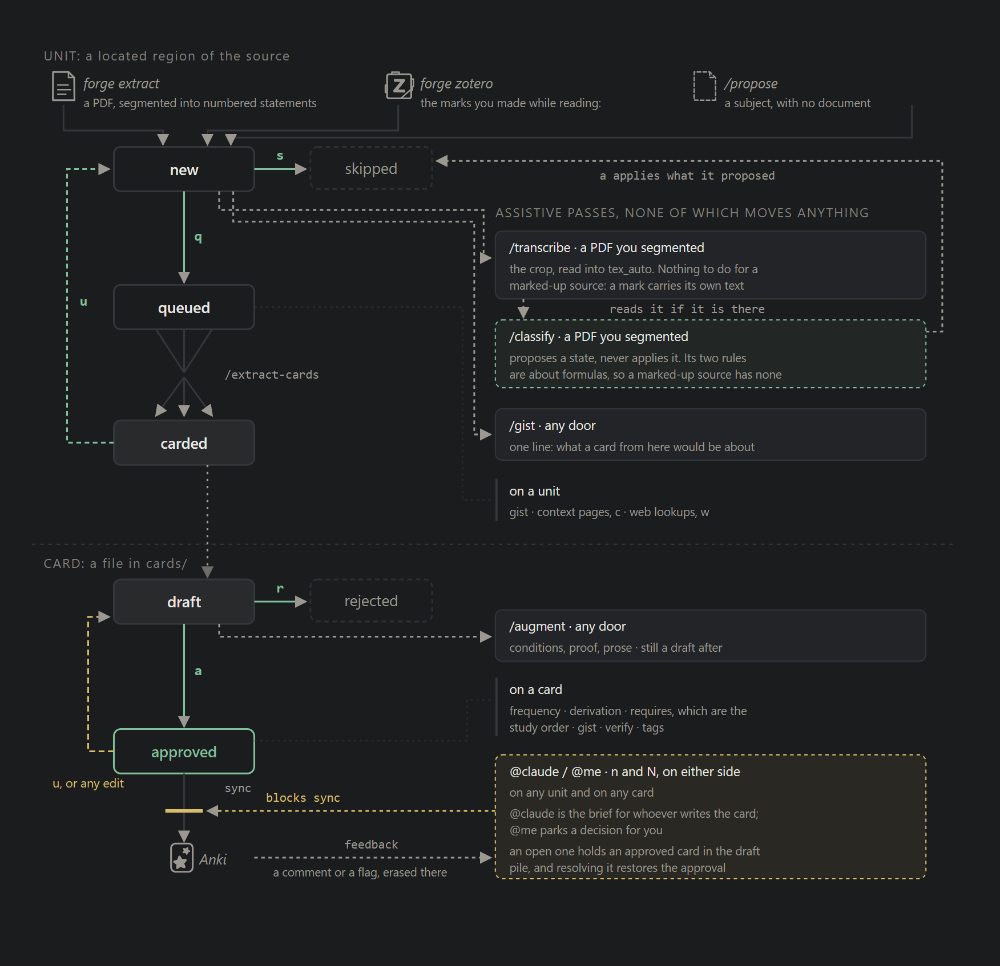
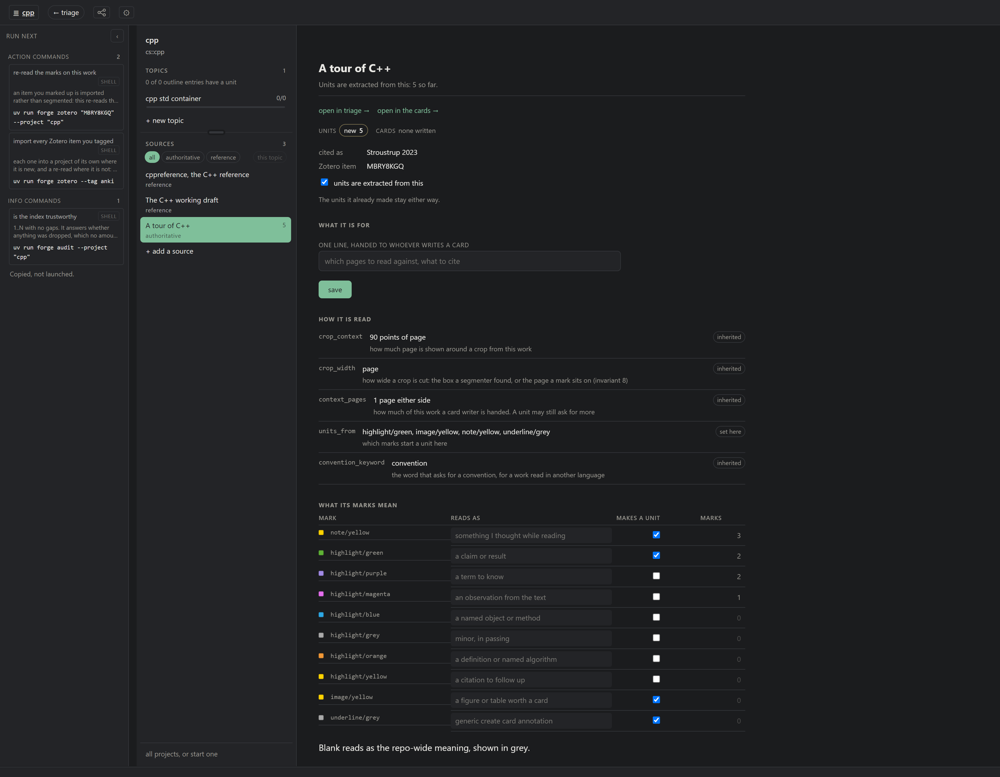
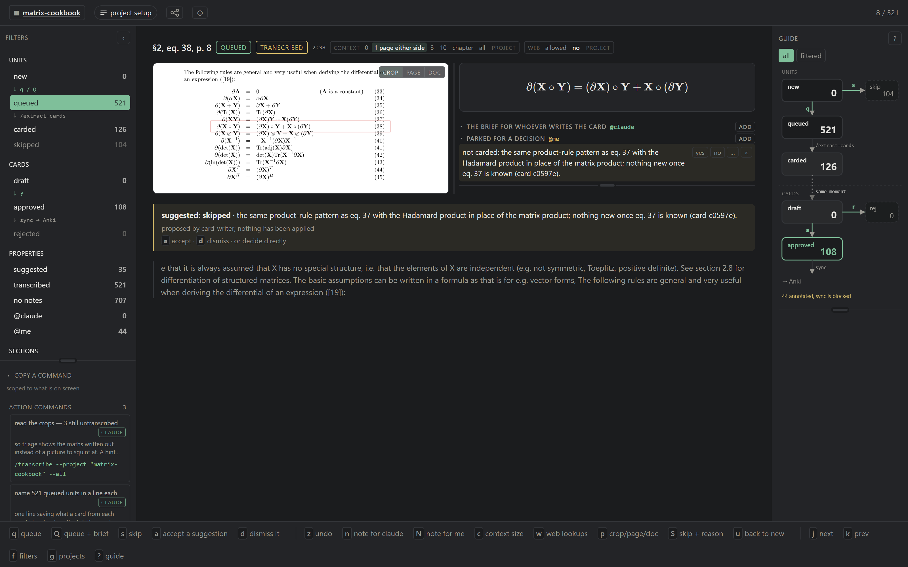
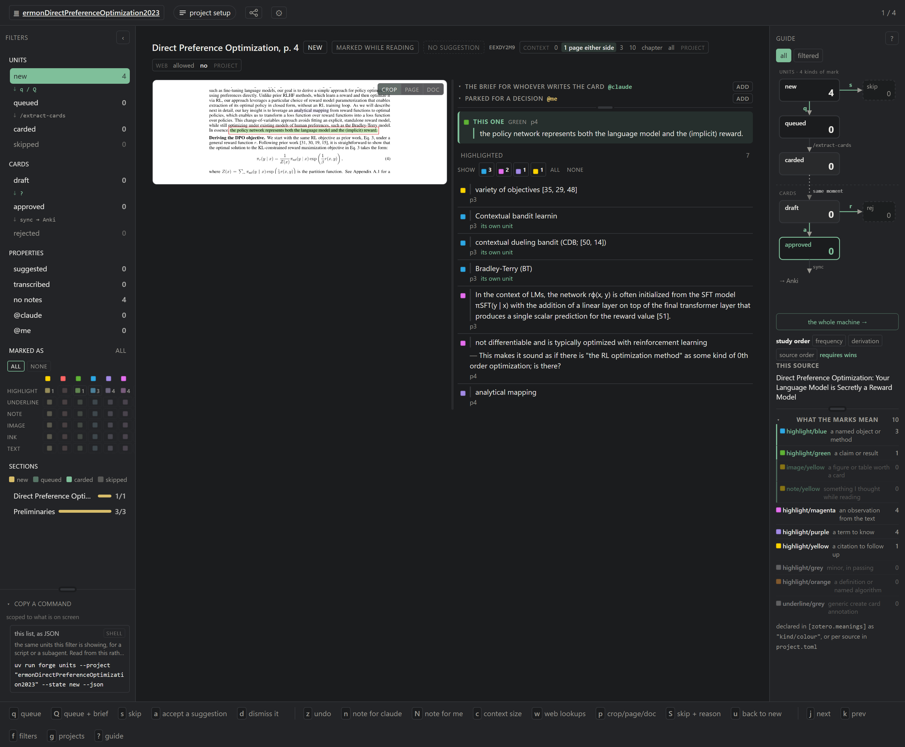
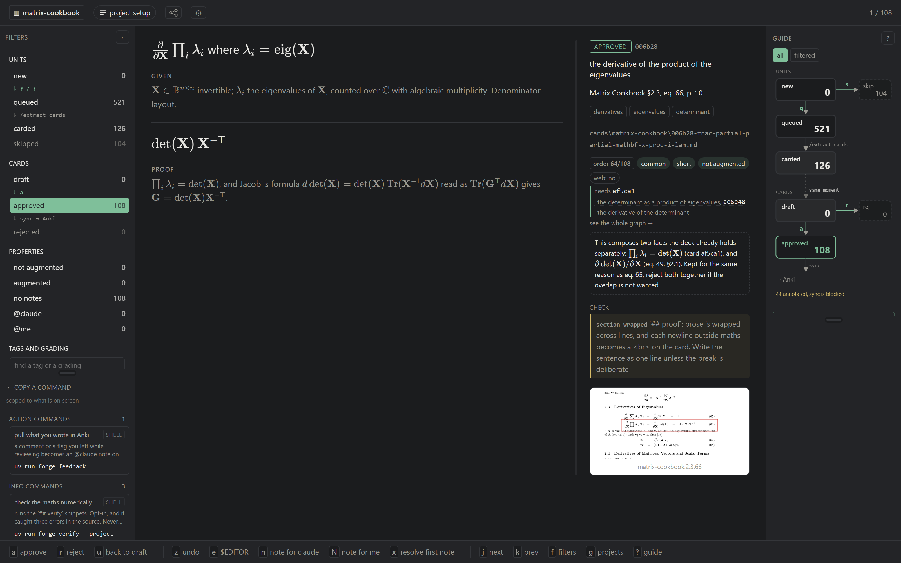
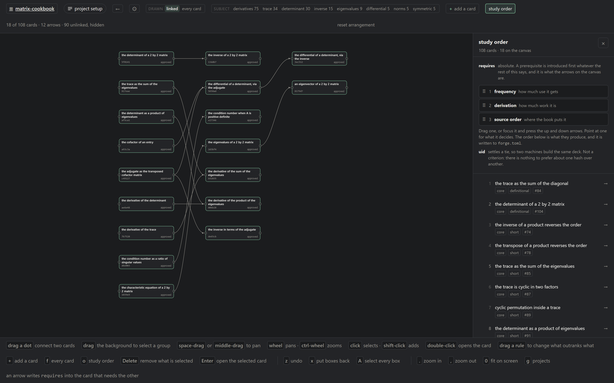

# anki-math-forge

[](https://github.com/robin-koppelhuber/anki-math-forge/actions/workflows/checks.yml)
[](LICENSE)
[](pyproject.toml)
[](https://apps.ankiweb.net/)
[](https://www.zotero.org/)


Turn math-heavy texts into Anki cards with a human in the loop.

1. Import standalone PDFs, entries from your Zotero collection or just start from an idea.
2. Decide which parts of a source are worth putting into a card.
3. Generate cards and iterate until they are perfect.

## Features
- Local website to build cards and iterate together with AI.
- Import standalone PDFs, entries from your Zotero collection or just start from an idea.
- Use Zotero annotations as the starting point for your cards, and map
  annotation types to different meanings for the agent.
- Augment equations with proof outlines, intuition and use cases.
- Optimized study order: let AI classify the usefulness, hardness and dependency between cards and explore them in a graph view, for the optimal initial study order in Anki.
- Sync cards to Anki and update safely if something changes.
- Write card feedback directly in Anki, sync it back into the website and improve your cards.

---
- Supported models: currently only works with a Claude Code subscription, no
  API key needed. The website gives you Claude skill commands to run instead
  of triggering API calls from code.


## Quickstart

```
git clone https://github.com/robin-koppelhuber/anki-math-forge
cd anki-math-forge
uv sync --extra pdf      # PyMuPDF (AGPL), needed to read PDFs
npm install              # optional: gives `check` the real KaTeX parser
```

```toml
# projects/<name>/project.toml, for a PDF source
title = "The Matrix Cookbook"
citation = "Matrix Cookbook"
deck = "Mathematics::Matrix Calculus"   # optional; falls back to [anki] deck

[[sources]]                             # one table per work the project reads
files = ["projects/<name>/the-file.pdf"]
```

For a Zotero source instead: run Zotero (version 7+) with its local API enabled
(*Settings > Advanced*), tag the item `anki`, and skip the `project.toml`. Its
cards go to `Zotero::<title>` unless the generated `project.toml` names a deck.

```
uv run forge extract <name>            # or: uv run forge zotero --tag anki
uv run forge serve                     # http://127.0.0.1:8000, press ? for the guide
```

Anki, once:

1. Install AnkiConnect: *Tools > Add-ons > Get Add-ons*, code `2055492159`,
   restart Anki.
2. Leave Anki running while you sync. `sync` talks to
   `http://127.0.0.1:8765`; `ANKI_CONNECT_URL` or `[anki] url` changes it.
3. The deck and the note type are created on the first sync.

## Workflow
Creating cards is a two stage process
1. Create and select **Units**: These are candidate parts of a page in a source for becoming a card. They are cheap to create and change
2. Create and refine **Cards**: Once you've selected which units should become cards, a thorough agent can create a card draft for you to iterate on
```
extract / import  ->  units  ->  triage  ->  cards  ->  review  ->  sync
                                 (you)       (Claude)   (you)
```


```
# route 1: a PDF
uv run forge extract <project>        # PDF -> units. Never reads the maths
/transcribe --project <project>         # crops -> LaTeX, via subagents
/classify --project <project>           # propose skips; applies nothing

# route 2: a marked-up paper in Zotero (needs Zotero running, local API on)
uv run forge zotero --list            # what Zotero has, and what is already a source
uv run forge zotero --tag anki        # every item tagged `anki` -> units

# route 3: a subject, with no document to segment
uv run forge project <project>        # start one
uv run forge topic 'a subject' --project <project> --ask '...'
/sources --project <project>            # what its cards can be checked against
/propose --project <project> 'a subject'  # the ask -> units

# every route
/gist --project <project>               # one line per unit: what its card would be about
uv run forge serve                    # triage units, then review cards
/extract-cards --project <project>      # queued units -> draft cards
/augment --project <project>            # conditions, proof, prose, tags
uv run forge sync --dry-run           # then without --dry-run
```














## Commands

Every session:

| `forge` | |
|---|---|
| `serve` | the web app: project setup, triage, review, dependency canvas. `--port` |
| `check` | lint; blocks sync on error. `--anki` also checks uids against the live collection |
| `sync` | approved cards -> Anki, upsert by uid. `--dry-run`, `--project`, `--templates`, `--reposition`, `--move-decks` |
| `feedback` | Anki comments and flags -> notes on the card. `--dry-run` |
| `todo` | open annotations, `@claude` and `@me` |

Once per project or source:

| `forge` | |
|---|---|
| `project <name>` | start one with no document. `--title`, `--deck`, `--citation`; `--delete` takes it and its cards out, `--force` if it holds any |
| `topic '<subject>' --project NAME` | what you want cards for; `--ask` what you want from it |
| `extract [project]` | PDF -> units; never writes cards. `--pages` |
| `zotero [item]` | Zotero marks -> units. `--list`, `--tag`, `--project`, `--dry-run` |
| `sources` | every work in the repo, and which project reads it. `--remove KEY`, `--force`, `--dry-run` |
| `export [project]` | a deck as `.apkg`; `--deck`, `--out`, `--scheduling` includes review history |
| `audit` | is the ledger trustworthy: 1..N, no gaps |

In the order the pipeline runs them:

| Claude Code | |
|---|---|
| `/propose --project NAME '<subject>'` | a subject -> units, where there is no document to segment |
| `/sources --project NAME` | reference material to check a card against; every line stays pending until you take it |
| `/transcribe --project NAME` | crops -> LaTeX, via subagents |
| `/classify --project NAME` | propose which units are not worth a card |
| `/gist --project NAME` | one line per unit on what its card would be about |
| `/extract-cards --project NAME` | queued units -> draft cards |
| `/augment --project NAME` | conditions, proof, prose, tags on drafts. Run before approving |
| `/triage claude [--project NAME]` | work the open `@claude` annotations |

Mostly called by the skills, or from a script:

| `forge` | |
|---|---|
| `units` | view or change the ledger: state, gist, notes, transcription, web lookups. `--add SLUG` writes one where there was nothing to segment |
| `context <unit-id>` | the page a unit was printed on, plus the source's conventions. `--pages N` either side, or `--pages chapter` |
| `source-text [project]` | the document's cached text layer |
| `crops` | render unit crops to a directory. `--out`, `--untranscribed`, `--ungisted` |
| `classify` | propose skips; applies nothing. `--dry-run` records nothing either |
| `new` | scaffold a draft card from a queued unit; repeat `--unit` to build one card from several |
| `verify` | opt-in numeric check of identities. `--uid`, `--project`, `--trials` |

| Keys | units | review | graph |
|---|---|---|---|
| decide | `q` queue, `Q` queue + brief, `s` skip, `S` skip + reason, `a` accept a suggestion, `d` dismiss it | `a` approve, `r` reject | `+` add a card, `Delete` remove selection, `Enter` open card |
| repair | `u` back to new, `z` undo, `n` note for claude, `N` note for me, `c` context size, `w` web lookups, `p` crop/page/doc | `u` back to draft, `z` undo, `e` `$EDITOR`, `n`, `N`, `x` resolve first note | `z` undo, `x` put boxes back, `A` select all |
| move | `j` `k` next/prev, `f` filters, `g` projects, `?` guide | same | `.` `,` zoom, `0` fit, `f` every card, `o` study order, `g` projects |

## Debugging
- "cannot reach AnkiConnect" means Anki is closed.
- `sync` does not push the card template; `sync --templates` does.
- Changing a source's deck sends new notes there. `sync` names the cards left
  behind, and `sync --move-decks` moves them.
- `[decks]` in `project.toml` splits `identity` and `intuition` into subdecks, so each gets its own new-card limit.
- Study order: `frequency`, then `derivation`, then printed order;
 `requires` overrides. `sync --reposition` moves cards you have not
 studied yet.
- Feedback: `E` in Anki writes the `Feedback` field, `Ctrl+1..7` sets a flag.

## Contributing & License
Happy for any contributions, open a PR.

License: MIT. `--extra pdf` pulls PyMuPDF, which is AGPL.
